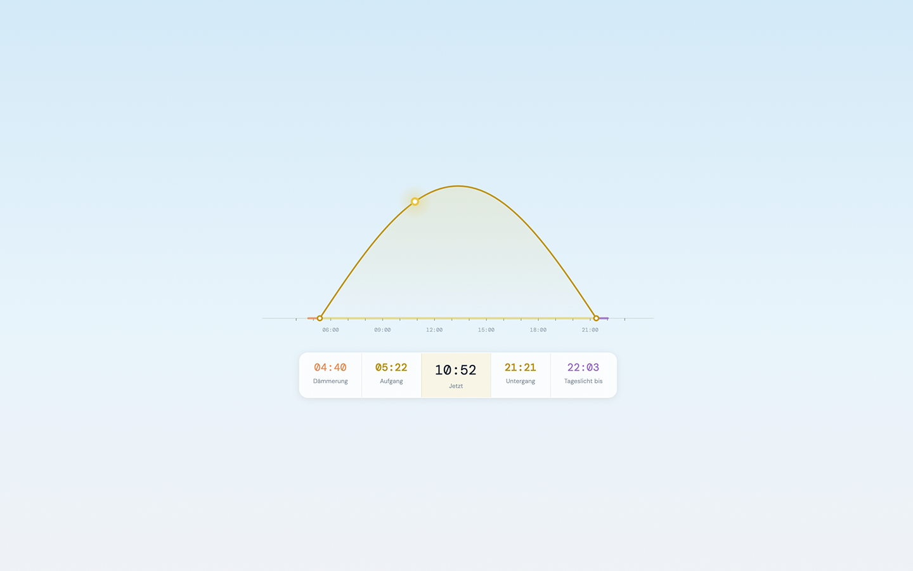
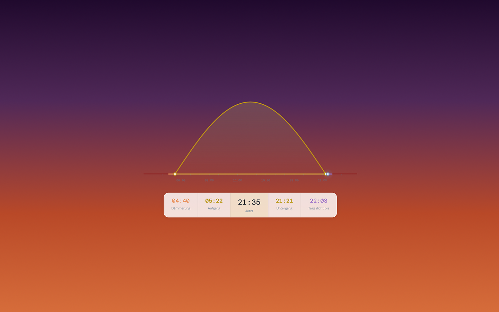
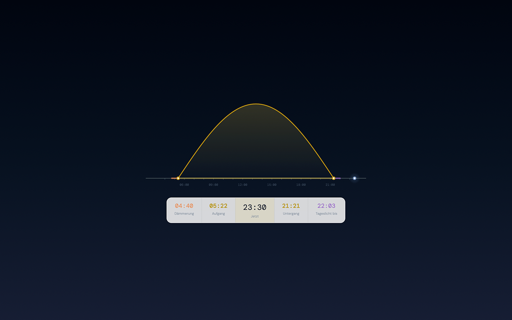
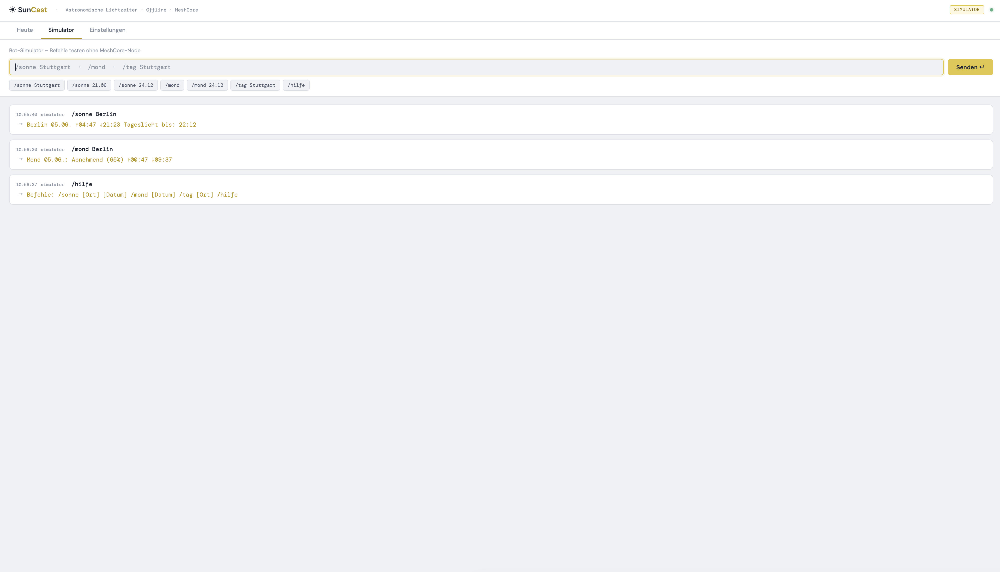
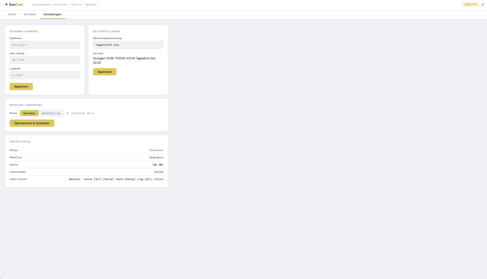

# ☀ SunCast

**Astronomische Licht- und Dämmerungszeiten offline im MeshCore-LoRa-Netz.**

SunCast ist ein eigenständiger Open-Source-Bot der Sonnenaufgang, Sonnenuntergang, Ende des nutzbaren Tageslichts und Mondphase vollständig offline berechnet – kein Internet, keine API, keine Cloud. Die Ergebnisse sind direkt im LoRa-Mesh verfügbar.

> „Tageslicht bis 22:03" statt „Ende der bürgerlichen Dämmerung"

---



---

## Funktionen

- `/sonne Stuttgart` → Aufgang, Untergang, Tageslicht bis (Ende bürgerliche Dämmerung)
- `/sonne Stuttgart 24.12` → gleiche Infos für ein bestimmtes Datum
- `/mond` → Mondphase (Name + Prozent), Mondaufgang, Monduntergang
- `/tag Stuttgart` → Tageslänge heute, längster/kürzester Tag im Vergleich
- `/hilfe` → Befehlsübersicht

Alle Berechnungen laufen lokal auf dem Raspberry Pi via [astral](https://pypi.org/project/astral/). Keine Internetverbindung nötig – auch im Katastrophenfall.

---

## Dashboard

SunCast bietet ein lokales Web-Dashboard auf Port 8081 mit Sonnenverlauf-Visualisierung, Tagesinfo und Bot-Simulator.

| Tagsüber | Dämmerung | Nacht |
|----------|-----------|-------|
|  |  |  |

### Bot-Simulator

Befehle direkt im Browser testen – kein MeshCore-Node nötig.



### Einstellungen & MeshCore-Verbindung

Standort setzen, Dämmerungsbezeichnung konfigurieren, zwischen Simulator und Live-Modus umschalten.



---

## Hardware

| Komponente | Modell | Funktion |
|---|---|---|
| Raspberry Pi | 3B+ (bereits vorhanden) | Hauptrechner, läuft parallel zu WarnBridge |
| MeshCore-Node | Heltec WiFi LoRa 32 v3 | Eigener Node „SunCast" im Mesh |
| USB-Kabel | Micro-USB | Stromversorgung Heltec |

SunCast läuft als eigenständiger Prozess neben [WarnBridge](https://github.com/TogeriX-hub/dab-warnings-meshcore) auf demselben Pi – eigener Port (8081), eigener MeshCore-Node.

---

## Installation

### Mac (Entwicklung / Simulator)

```bash
git clone https://github.com/TogeriX-hub/suncast.git
cd suncast
bash install.sh
python3 suncast.py
```

Dashboard öffnen: [http://localhost:8081](http://localhost:8081)

### Raspberry Pi (Echtbetrieb)

```bash
git clone https://github.com/TogeriX-hub/suncast.git
cd suncast
bash install_pi.sh
```

Danach `config.yaml` anpassen:

```yaml
meshcore:
  simulator: false
  host: 192.168.4.2      # IP des Heltec #2
  channel_idx: 0

location:
  default: Stuttgart     # oder dein Ort
```

Service starten:

```bash
sudo systemctl start suncast
sudo systemctl status suncast
journalctl -u suncast -f
```

---

## Konfiguration

```yaml
meshcore:
  host: 192.168.4.2        # IP des Heltec #2 im Pi-Hotspot
  port: 4403
  simulator: true          # false = Echtbetrieb
  channel_idx: 0           # MeshCore Channel-Index
  scope: '*'               # Flood-Scope

location:
  default: Stuttgart
  timezone: 'Europe/Berlin'

dashboard:
  port: 8081

bot:
  twilight_label: 'Tageslicht bis'   # oder 'Taschenlampe ab'
```

---

## Bot-Befehle

| Befehl | Beispiel | Antwort |
|--------|----------|---------|
| `/sonne [Ort]` | `/sonne Stuttgart` | `Stuttgart 05.06.  ↑05:22  ↓21:21  Tageslicht bis: 22:03` |
| `/sonne [Ort] [Datum]` | `/sonne Stuttgart 24.12` | `Stuttgart 24.12.  ↑08:14  ↓16:23  Tageslicht bis: 16:58` |
| `/mond` | `/mond` | `Mond 05.06.: Zunehmend (68%)  ↑14:22  ↓02:41` |
| `/mond [Datum]` | `/mond 24.12` | `Mond 24.12.: Vollmond (98%)  ↑15:44  ↓07:12` |
| `/tag [Ort]` | `/tag Stuttgart` | `Stuttgart heute: 16h 6min  Max 21.06.: 16h36min  Min 21.12.: 8h30min` |
| `/hilfe` | `/hilfe` | Befehlsübersicht |

Alle Antworten sind auf 120 Zeichen begrenzt (MeshCore-Limit). Bei längeren Antworten werden maximal 2 Nachrichten gesendet.

---

## Im echten Mesh


SunCast erscheint im Mesh unter dem Node-Namen **„SunCast"** und antwortet nur auf direkte Anfragen – kein automatischer Broadcast.

---

## Verwandte Projekte

| Projekt | Beschreibung |
|---------|-------------|
| [WarnBridge](https://github.com/TogeriX-hub/dab-warnings-meshcore) | DAB+-Notfallwarnungs-Bot, läuft parallel auf demselben Pi |
| [FieldMesh](https://github.com/TogeriX-hub/FieldMesh) | MeshCore-Firmware-Fork für Off-Grid-Einsatz |
| [astral](https://pypi.org/project/astral/) | Python-Bibliothek für astronomische Berechnungen |

---

## Dateistruktur

```
suncast.py          – Hauptprogramm, asyncio Event-Loop, Bot, MeshCore-Client
web_ui.py           – aiohttp Dashboard-Server (Port 8081)
dashboard.html      – Browser-Frontend mit Sonnenverlauf-Visualisierung
config.yaml         – Konfiguration
requirements.txt    – Python-Abhängigkeiten
install.sh          – Mac-Installation
install_pi.sh       – Raspberry Pi Installation
suncast.service     – systemd Autostart
```

---

*Tobias / Sindelfingen · Juni 2026*
